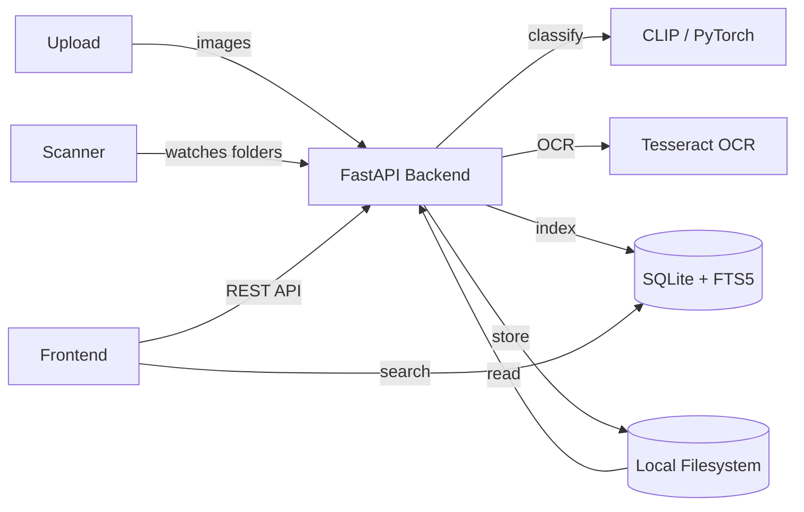

# Screensort

AI-powered screenshot organizer. Classifies, scans, searches, and manages local screenshots using CLIP embeddings, Tesseract OCR, and full-text search.

## Overview

Organizes screenshots through ML classification and intelligent search. Uses PyTorch + CLIP for image classification, Tesseract OCR for text extraction, and SQLite FTS5 for full-text search. Supports Docker for containerized deployment.

## Core Architecture



## System Components

| Component | Responsibility |
|---|---|
| `backend/app/` | FastAPI routes, models, and business logic |
| `backend/core/` | CLIP classification, OCR processing, indexing |
| `backend/features/` | Upload, scan, search, delete feature modules |
| `backend/pages/` | Backend page/route handlers |
| `frontend/` | React + Vite + Tailwind dashboard |
| `docker-compose.yml` | Container orchestration |
| `tests/` | Backend test suite |

## Repository Layout

| Directory | Purpose |
|---|---|
| `backend/` | FastAPI REST API server |
| `frontend/` | React dashboard client |
| `docker-compose.yml` | Docker deployment |
| `tests/` | Backend tests |

## Technology Stack

| Layer | Technology | Purpose |
|---|---|---|
| Frontend | React + TypeScript + Vite | Dashboard UI |
| Styling | Tailwind CSS | UI styling |
| Backend | FastAPI + Python | REST API |
| ML | PyTorch + CLIP | Image classification |
| OCR | Tesseract OCR | Text extraction from screenshots |
| Search | SQLite + FTS5 | Full-text search |
| Storage | Local filesystem | Screenshot storage |
| Container | Docker + Nginx | Deployment |

## Requirements

- Python 3.10+
- Node.js 18+
- npm
- Docker (recommended)
- Tesseract OCR (if running locally)

## Configuration

| File | Purpose |
|---|---|
| `docker-compose.yml` | Service orchestration |
| `backend/.env` | Backend configuration |
| `frontend/.env` | Frontend configuration |

## Getting Started

```bash
# Docker (recommended)
docker compose up --build

# Open http://localhost:5173

# Local development
cd backend
uv run uvicorn app.main:app --reload
cd frontend
npm run dev
```

## Development

```bash
docker compose --profile watcher up --build  # With file watcher
npm run dev                                    # Frontend dev server
uv run uvicorn app.main:app --reload           # Backend dev server
```
